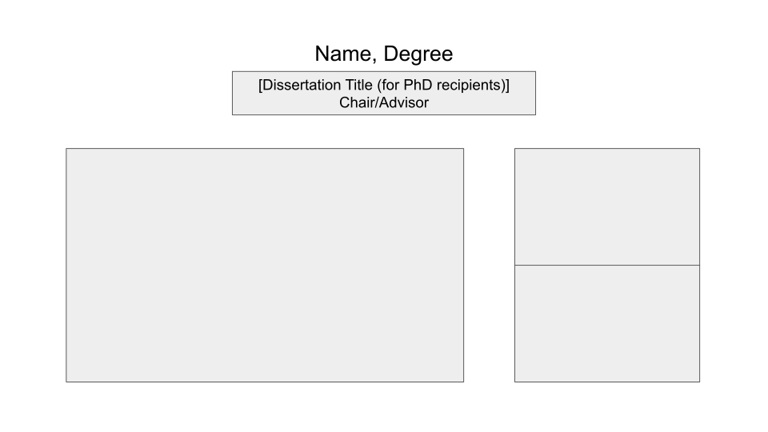
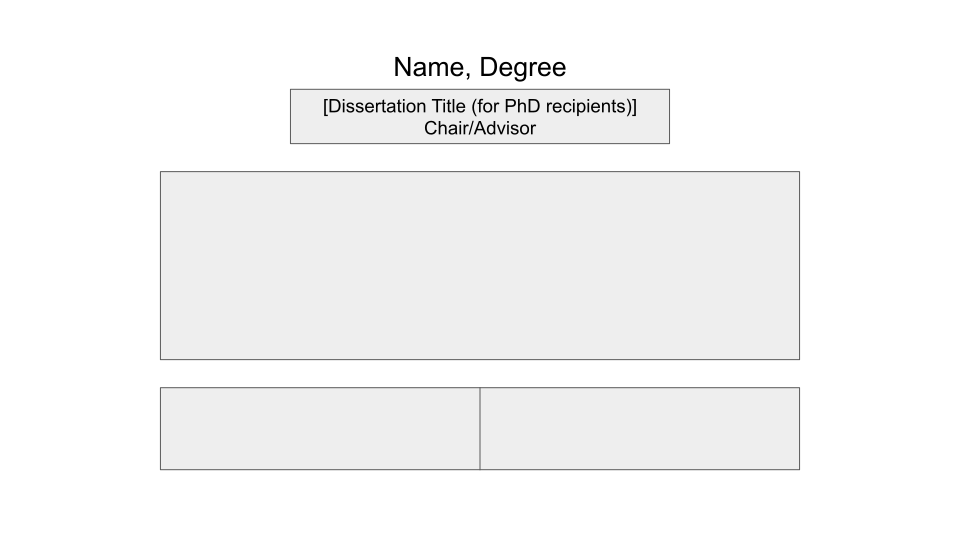
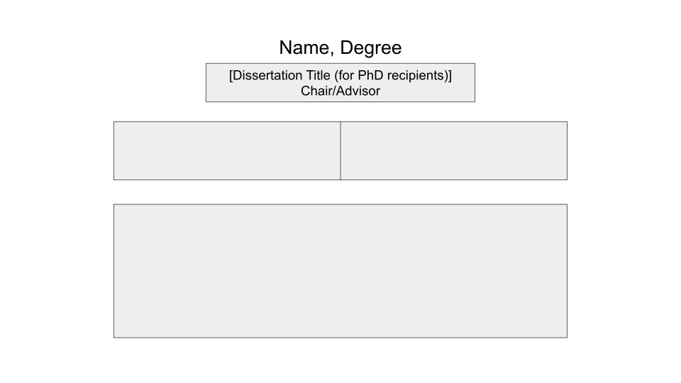

# Layout B permutation example

### (Dissertation title)<br>Chair/Advisor

*** =info

`r create_img('https://images.unsplash.com/photo-1445499348736-29b6cdfc03b9?w=900')`

--- .info .layout

# Layout C

<br>

**Specifications**

Large landscape image on left

1-2 pieces of text on right

<br>

**Permutations**



---

# Layout C permutation example

### (Dissertation title)<br>Chair/Advisor

*** =info

`r create_img('https://images.unsplash.com/photo-1445499348736-29b6cdfc03b9?w=900')`

<div class="quote" style="width:200px"><p>Purus gravida quis blandit turpis cursus in hac habitasse platea. Leo in vitae turpis massa sed.</p><p>- Source</p></div>

--- .gold

# Layout C permutation example

### (Dissertation title)<br>Chair/Advisor

*** =info

`r create_img('https://images.unsplash.com/photo-1445499348736-29b6cdfc03b9?w=900')`

<div class="flex-container">

<div class="quote" style="width:200px"><p>Lorem ipsum dolor sit amet, consectetur adipiscing elit.</p><p>- Source</p></div>
<div class="quote" style="width:200px"><p>Purus gravida quis blandit turpis cursus in hac habitasse platea. Leo in vitae turpis massa sed.</p><p>- Source</p></div>

</div>

--- .info .layout #layoutD

# Layout D

<br>

**Specifications**

Large landscape image on top (or bottom)

1-2 pieces of text on bottom (or top)

<br>

**Permutations**

<div style="display:flex">




</div>

--- .flex-invert .gold

# Layout D permutation example

### (Dissertation title)<br>Chair/Advisor

*** =info

`r create_img('https://images.unsplash.com/photo-1444021907648-1baf30e38d9e?w=900')`

<div class="flex-container">

`r create_quote('Lorem ipsum dolor sit amet, consectetur adipiscing elit.')`
`r create_quote('Lorem ipsum dolor sit amet, consectetur adipiscing elit.')`

</div>

--- .flex-invert

# Layout D permutation example

### (Dissertation title)<br>Chair/Advisor

*** =info

<div class="flex-container">

`r create_quote('Lorem ipsum dolor sit amet, consectetur adipiscing elit.')`

</div>

`r create_img('https://images.unsplash.com/photo-1444021907648-1baf30e38d9e?w=900')`

---

## Speakers

---

# Professor Patricia McDonough, HEOC Division Head

---

# Dr. Natacha M. Cesar-Davis

---

# Dr. Connie Chang

---

## Master of Arts in Education

--- &twocol .gold .compact

# Noel Bynum, M.A.

### Advisor: Kevin Eagan

*** =left

`r create_img('noelb.JPG')`

*** =right

`r create_quote('You have to decide who you are and force the world to deal with you, not with its idea of you.', 'James Baldwin')`
`r create_textbox("Thank you to my family, Tom, my friends and my cohort for all the support to get me this far! It's been one heck of a year but thankful for all the growth, new friends, and future we have to look forward to together. Next stop: Ph.D.!")`

--- &twocol .compact

# Daniela Conde, M.A.

### Advisor: Jessica Harris

*** =left

`r create_img('danielac.jpg')`

*** =right

`r create_textbox("Esto es pa' mi familia. Esto es pa' mi gente! This is for BIPOC migrant communities.<br><br>Lo hicimos, Má! Lo hicimos, hermanas! In our togetherness, we thrive. Siempre con La Morenita a nuestro lado. Gracias for teaching me in all ways, Má, especially how to freedom-dream y como luchar! S/o to the LA (& heoc) homies too. Y aquí seguiremos pa' delante towards the Ph.D.", style='width:260px;')`

--- &twocol .compact

# Kiana Foxx, M.A.

### Advisor: Walter Allen

*** =left

`r create_img('kianaf.jpg')`

*** =right

`r create_textbox('Thank you to my family, friends, and the HEOC community. You made this possible and your support is appreciated! Next stop Ph.D.', style='transform:translateX(-20px);')`


--- &twocol

# Fernando Garcia, M.A.

### Advisor: Cecilia Rios-Aguilar

*** =left

`r create_img('fernandog.jpg')`

*** =right

`r create_textbox("Gracias a mi familia, mis amig@s, y la comunidad que me ayodo a lograr esto. Todavio no terminamos, pero ya estamos llegando mas cerca! Y como me dice mi profe, 'ni pa un lado, ni pal otro, siempre pa delante'. Gracias. Los amo.")`

--- &twocol .l60-r38

# Demeturie Toso-Lafaele Gogue, M.A.

### Advisor: Mitchell Chang

*** =left

`r create_img('demeturieg.jpg')`

*** =right

`r create_textbox("This degree is not only a representation of my accomplishments but also the love and support that family, friends, and mentors have poured into me. I am tall because I stand on the shoulders of giants.<br><br>To my late grandparents, Sentenari Tolo and Tupou Tolo: Fa'afetai tele mo le lua tapūa'iga. E ui lava ua fai i lagi le fōlaūga, ae le mafai ona galo ā'ōa'ōga ma fautuāga. O lea foi ua fa'amanuiaina au i leisi au fa'ailōga Master of Arts.", style='width:250px;transform:translateX(30px);')`


--- .tall .flex-invert

# Cymone Bre'Ahn Mack, M.A.

### Advisor: Walter Allen

*** =info

`r create_img('cymonem.JPG', style='height:65%;')`

`r create_quote('What if I fall? Oh but my darling, what if you fly?', 'Eric Hanson', style='width:380px')`

--- &twocol .compact

# Elizabeth Martin, M.A.

### Advisors: Kevin Eagan & Cecilia Rios-Aguilar

*** =left

`r create_img('elizabethm.jpeg')`

*** =right

`r create_quote('Be the brightest of the bunch', 'Lilly Pulitzer', style='width:250px;transform: translateX(-60px);')`


--- &twocol .gold

# Kaitlyn Stormes, M.A.

### Advisor: Linda Sax

*** =left

`r create_img('kaitlyns.jpeg', style='transform: translate(20px, -10px);')`

*** =right

`r create_quote('There is no problem in science that can be solved by a man that cannot be solved by a woman.', 'Vera Rubin', style='transform: translateX(20px);')`

`r create_textbox("This quote is why I returned to school in pursuit of becoming Dr. Stormes, and it represents my interest in increasing representation of women in STEM. Thank you to my partner, family, and mentors for your support along the way.", style='transform: translateX(20px);')`

--- .info

# Master of Arts in Education

<br><br>

**Azeb Tadesse, M.A.**

Advisor: Walter Allen

<br>

**Name, M.A.**

Advisor

<br>

**Name, M.A.**

Advisor

---

## Doctor of Philosophy in Education

--- &twocol

# Natacha Cesar-Davis, Ph.D.

### The Unguided Path: A Qualitative Study About the Vocational Identity Development of Black and Latinx Emerging Adults at a Community College<br>Chairs: Cecilia Rios-Aguilar & Carola Suarez-Orozco

*** =left

`r create_img('natachacd.JPG', style='transform:translate(10px, -10px);')`

*** =right

`r create_textbox("HEOC, you have given me so much over the past four years! Thank you to all the faculty who have taught me so much about our field. Thank you to my advisor, Santa Cecilia, you are everything I prayed for in an advisor and more. And thank you to the BEST cohort of people brought together in HEOC's history, my doctoral journey would have not been the same without your enriching presence... each of you are my family forever")`

--- &twocol .tall

# Connie Chang, Ph.D.

### Examining Racial Consciousness: Asian Americans and Affirmative Action<br>Chair: Mitchell Chang

*** =left

`r create_img('conniec-left.jpg', style='transform:translateY(-20px);height:98%;')`

*** =right

`r create_img('conniec-right.jpg', style='height:55%')`

`r create_textbox("Thank you to the HEOC faculty and friends, especially Mitch, for believing in and supporting me. It's been an honor to learn from each and everyone of you. I will carry with me the important lessons of critical research, empathy, and advocacy for social change.", style='width:340px;')`

--- &twocol .l60-r38

# Katherine Cho, Ph.D.

### How Did We Get Here? Actually We've Always Been: Examining Institutional Responses to Campus Racism and Student Activism<br>Chairs: Sylvia Hurtado

*** =left

`r create_img('katherinec.jpeg')`

*** =right

`r create_textbox('This dissertation reflects the power and support of community: the generations of people who fought for racial justice; the people who are fighting for it now; the relationships, friendships, laughter, and spaces that sustain us as the fight continues. To my community: friends, my amazing cohort, femtors, mentors, a most wonderful chair and committee, and of course, my parents: thank you always.', style='width:260px')`

--- &twocol .tall

# Kari George, Ph.D.

### Decoding Doctoral Student Departure: A Mixed-Methods Study of Faculty Perceptions and Student Realities in Computing<br>Chair: Linda Sax

*** =left

`r create_img('karig-left.jpg', style='transform:translateY(-20px);height:98%;')`

*** =right

`r create_img('karig-right.JPG', style='height:60%')`

`r create_textbox('Sending a heartfelt thanks to my village—my cohort and HEOC family, and my friends, family, and sidekick—for all the support that made this possible!', style='width:300px')`


--- .custom .tall

# Die Hu, Ph.D.

### Faculty Collaboration Network and the Global Ambitions of Chinese Universities: The Case of Tsinghua<br>Chairs: Robert Rhoads & Cecilia Rios-Aguilar

*** =info

`r create_img('dieh-topleft.jpeg')`
`r create_img('dieh-topright.jpeg')`

`r create_img('dieh-bottomleft.JPG')`
`r create_img('dieh-bottomright.jpeg')`

--- &twocol .l60-r38

# Shuai Li, Ph.D.

### Big Frog in Small Pond: Undermatching Status, College Major, and Their Influences on Early Career Earnings<br>Chairs: Robert Rhoads & Kevin Eagan

*** =left

`r create_img('shuail.jpg')`

*** =right

`r create_textbox('Heartfelt thanks to everyone who has helped me along the journey!')`

--- .info

# Doctor of Philosophy in Education

<br><br>

**Benjamin John Logan, Ph.D.**

Beyond Acculturation: Towards a Non-Deficit View of International Students' Culture and Support Networks

Chairs: Robert Rhoads & Patricia McDonough

<br>

**Name, Ph.D.**

Dissertation Title

Chair

<br>

**Name, Ph.D.**

Dissertation Title

Chair

--- .title

# Congratulations Graduates!

<div id="slides-end" class="slides-wrapper">

```{r, echo=FALSE, results='asis'}
img_dir <- file.path('.', 'assets', 'slideshow')
images <- list.files(img_dir)

for (i in images) {
  cat('<div class="slide">
    
  </div>', sep = '')
}
```

</div>

<audio loop data-autoplay>
  <source src="./assets/audio/pomp-and-circumstance.mp3" type="audio/mpeg">
</audio>

---

<div style="margin-top:250px;">
  Created using R/RStudio
  <br><br>
  <a href="https://github.com/ozanj/heoc20grads" target="_blank">github.com/ozanj/heoc20grads</a>
</div>
